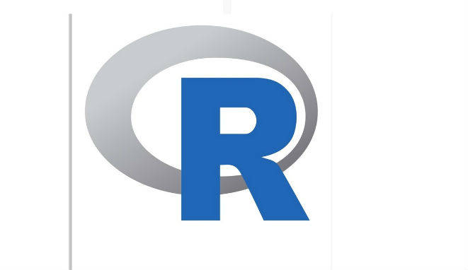
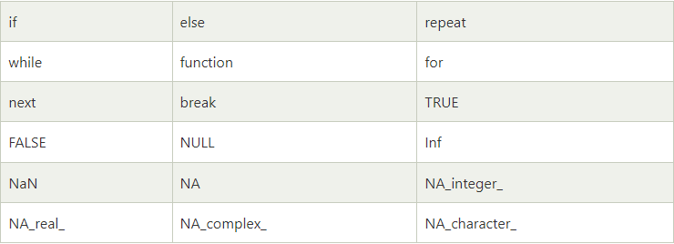
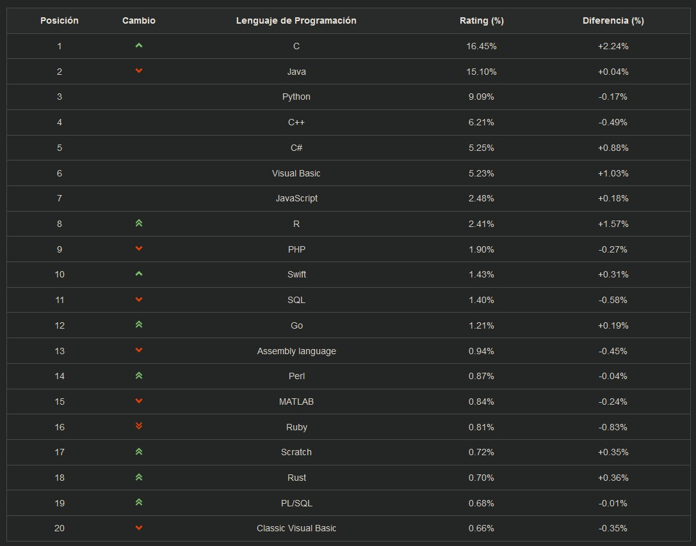

## Historia

  R es un entorno y lenguaje de programación con un enfoque al análisis estadístico.

R nació como una reimplementación de software libre del lenguaje S, adicionado con soporte para ámbito estático. Se trata de uno de los lenguajes de programación más utilizados en investigación científica, siendo además muy popular en los campos de aprendizaje automático (machine learning), minería de datos, investigación biomédica, bioinformática y matemáticas financieras. A esto contribuye la posibilidad de cargar diferentes bibliotecas o paquetes con funcionalidades de cálculo y graficación.

R es parte del sistema GNU y se distribuye bajo la licencia GNU GPL. Está disponible para los sistemas operativos Windows, Macintosh, Unix y GNU/Linux.

Fue desarrollado inicialmente por Robert Gentleman y Ross Ihaka del Departamento de Estadística de la Universidad de Auckland en 1993.1​ Sin embargo, si se remonta a sus bases iniciales, puede decirse que se inició en los Bell Laboratories de AT&T y ahora Alcatel-Lucent en Nueva Jersey con el lenguaje S. Este último, un sistema para el análisis de datos desarrollado por John Chambers, Rick Becker, y colaboradores diferentes desde finales de 1970. La historia desde este punto es prácticamente la del lenguaje S. Los diseñadores iniciales, Gentleman e Ihaka, combinaron las fortalezas de dos lenguajes existentes, S y Scheme. En sus propias palabras: "El lenguaje resultante es muy similar en apariencia a S, pero en el uso de fondo y la semántica es derivado desde Scheme". El resultado se llamó R "en parte al reconocimiento de la influencia de S y en parte para hacer gala de sus propios logros".2​

Su desarrollo actual es responsabilidad del R Development Core Team. Para saber más al respecto y en el entorno del programa, puede teclearse contributors(); el la lista desplegada aparecen los nombres de los autores iniciales y los actuales pertenecientes al R Development Core Team (Equipo Central de Desarrolladores R).
R proporciona un amplio abanico de herramientas estadísticas (modelos lineales y no lineales, tests estadísticos, análisis de series temporales, algoritmos de clasificación y agrupamiento, etc.) y gráficas.

Al igual que S, se trata de un lenguaje de programación, lo que permite que los usuarios lo extiendan definiendo sus propias funciones. De hecho, gran parte de las funciones de R están escritas en el mismo R, aunque para algoritmos computacionalmente exigentes es posible desarrollar bibliotecas en C, C++ o Fortran que se cargan dinámicamente. Los usuarios más avanzados pueden también manipular los objetos de R directamente desde código desarrollado en C. R también puede extenderse a través de paquetes desarrollados por su comunidad de usuarios.

R hereda de S su orientación a objetos. La tarea de extender R se ve facilitada por su permisiva política de lexical scoping.5​

Además, R puede integrarse con distintas bases de datos y existen bibliotecas que facilitan su utilización desde lenguajes de programación interpretados como Perl y Python.

Otra de las características de R es su capacidad gráfica, que permite generar gráficos con alta calidad. R posee su propio formato para la documentación basado en LaTeX.

Regresión y su análisis somero en R versión 3.2.2 y en el sistema operativo Windows
R también puede usarse como herramienta de cálculo numérico, campo en el que puede ser tan eficaz como otras herramientas específicas tales como GNU Octave y su equivalente privativo: MATLAB.6​Se ha desarrollado una interfaz, RWeka7​ para interactuar con Weka que permite leer y escribir ficheros en el formato arff y enriquecer R con los algoritmos de minería de datos de dicha plataforma.

## Compilado/Interpretado/Híbrido 

- R es un entorno de software libre (licencia GNU GLP) y lenguaje de programación interpretado, es decir, ejecuta las instrucciones directamente, sin una previa compilación del programa a instrucciones en lenguaje máquina. El término entorno, en R, se refiere a un sistema totalmente planificado y coherente, en lugar de una acumulación de herramientas específicas e inflexibles, como suele ser el caso en otros softwares de análisis de datos.

## Palabras clave.

- Las palabras clave son palabras reservadas específicas en R, cada una de las cuales tiene una característica específica asociada. Casi todas las palabras que ayudan a uno a utilizar la funcionalidad del lenguaje R están incluidas en la lista de palabras clave. ¡Así que uno puede imaginar que la lista de palabras clave no será pequeña! En R, uno puede ver estas palabras clave usando help(reserved)o ?reserved.
Algunos ejemplos son:

## Sensible o no a las mayusculas y minisculas.
- Es sensible a mayúsculas (case sensitive): no es lo mismo A que a.

## Remuneración

- Programar en R se asocia con un sueldo medio de 54.394 euros. El sueldo de este lenguaje es un 13,1% más alto que la media global.

## Tamaño de la comunidad

- A continuación vemos una tabla con los lenguajes de programación, en el cual el lenguaje en R tiene un rating de un 2,41% sobre el total.

## Influencias

- R ha sido fuertemente influenciado por otros dos lenguajes de programación. Estos incluyen "S" y el depósito de esquemas.

## Multiplataforma

- R es un lenguaje de plataforma independiente o multiplataforma, esto significa que su código puede ejecutarse en todos los sistemas operativos
  